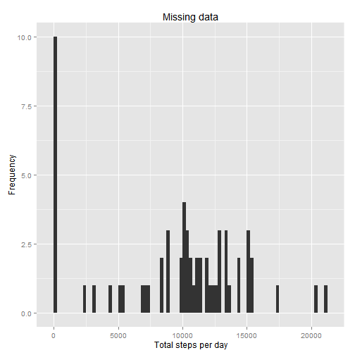
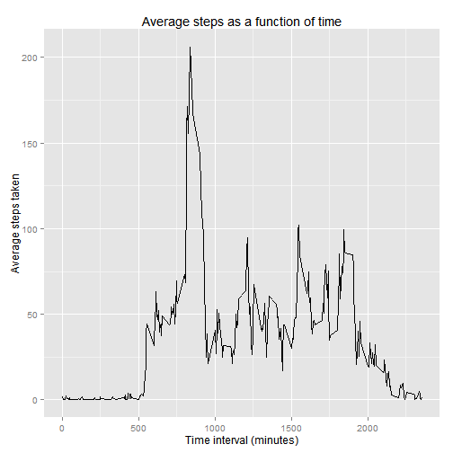
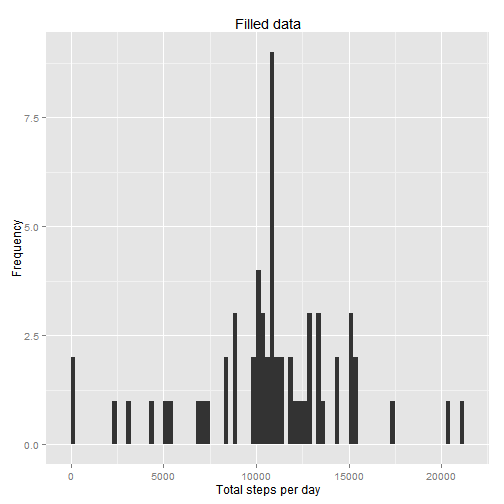
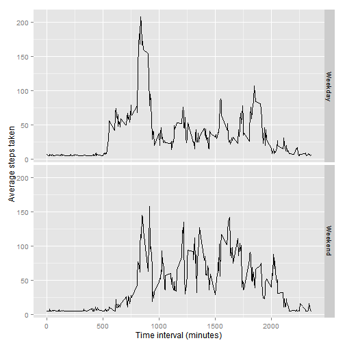

#Peer Assessment 1 - David C Latshaw II

##Introduction

It is now possible to collect a large amount of data about personal movement using activity monitoring devices such as a Fitbit, Nike Fuelband, or Jawbone Up. These type of devices are part of the "quantified self" movement - a group of enthusiasts who take measurements about themselves regularly to improve their health, to find patterns in their behavior, or because they are tech geeks. But these data remain under-utilized both because the raw data are hard to obtain and there is a lack of statistical methods and software for processing and interpreting the data.

This assignment makes use of data from a personal activity monitoring device. This device collects data at 5 minute intervals through out the day. The data consists of two months of data from an anonymous individual collected during the months of October and November, 2012 and include the number of steps taken in 5 minute intervals each day.

##Data

The data for this assignment can be downloaded from the course web site:

Dataset: [Activity monitoring data](https://d396qusza40orc.cloudfront.net/repdata%2Fdata%2Factivity.zip) [52K]
The variables included in this dataset are:

-steps: Number of steps taking in a 5-minute interval (missing values are coded as NA)  
-date: The date on which the measurement was taken in YYYY-MM-DD format  
-interval: Identifier for the 5-minute interval in which measurement was taken  

The dataset is stored in a comma-separated-value (CSV) file and there are a total of 17,568 observations in this dataset.

###Loading and preprocessing the data

In order to load the data unzip it and read it into a new variable:

```r
unzip(zipfile="repdata-data-activity.zip")
activity<-read.csv("activity.csv")
```
###What is mean total number of steps taken per day?
Calculate the total number of steps per day and produce a histogram showing the data:

```r
library(ggplot2)
totalsteps <- tapply(activity$steps, activity$date, FUN=sum, na.rm=TRUE)
p1<-qplot(totalsteps,binwidth=250,xlab="Total steps per day",
          ylab="Frequency",main="Missing data")
p1
```

 

Determine the mean and median number of steps per day:

```r
mean(totalsteps)
```

```
## [1] 9354.23
```

```r
median(totalsteps)
```

```
## [1] 10395
```
###What is the average daily activity pattern?
Calculate the average number of steps as a function of time and present it in a line plot:

```r
dailyactivity <- aggregate(steps~interval, data=activity, mean)
p2<-ggplot(data=dailyactivity, aes(x=interval, y=steps)) +
  geom_line() +
  xlab("Time interval (minutes)") +
  ylab("Average steps taken") +
  ggtitle("Average steps as a function of time")  
p2
```

 

Determine which time (in 5 minute intervals) has the largest number of steps:

```r
dailyactivity[which.max(dailyactivity$steps),]
```

```
##     interval    steps
## 104      835 206.1698
```
###Imputing missing values
Calculate and report the total number of missing vlaues in the data set:

```r
sum(is.na(activity))
```

```
## [1] 2304
```

Fill in missing data with the average number of steps per interval then apply it to the whole data set:

```r
library(Hmisc)
activityfilled<- activity
activityfilled$steps <- with(activityfilled, impute(steps, mean))
```
Calculate the total number of steps per day with the filled data set and produce a histogram showing the data:

```r
library(grid)
library(gridExtra)
totalstepsfilled <- tapply(activityfilled$steps, activityfilled$date, FUN=sum)
p3<-qplot(totalstepsfilled,binwidth=250,xlab="Total steps per day",
          ylab="Frequency",main="Filled data")
grid.arrange(p1,p3,ncol=2)
```

 

Determine the mean and median number of steps per day with the filled data set:

```r
mean(totalstepsfilled)
```

```
## [1] 10766.19
```

```r
median(totalstepsfilled)
```

```
## [1] 10766.19
```
The values for mean and median of the total number of steps differ from the data set with missign values. Both values are now higher because we filled in missing data with the average value for the 5 minute intervals.
###Are there differences in activity patterns between weekdays and weekends?
Create a function to differentiate between weekdays and weekends and and add it to data frame:

```r
daytype <- function(date) {
  if (weekdays(date) %in% c('Saturday', 'Sunday')) {
    return('Weekend')
  } else {
    return('Weekday')
  }
}
activityfilled$date<-as.Date(activityfilled$date)
activityfilled$day <- sapply(activityfilled$date, FUN=daytype)
```
Create a line plot for both weekend and weekdays to show difference in activity level:

```r
activityaverages <- aggregate(steps ~ interval + day, data=activityfilled, mean)
ggplot(activityaverages, aes(interval, steps)) +
  geom_line() + 
  facet_grid(day ~ .) +
  xlab("Time interval (minutes)") +
  ylab("Average steps taken")
```

 
